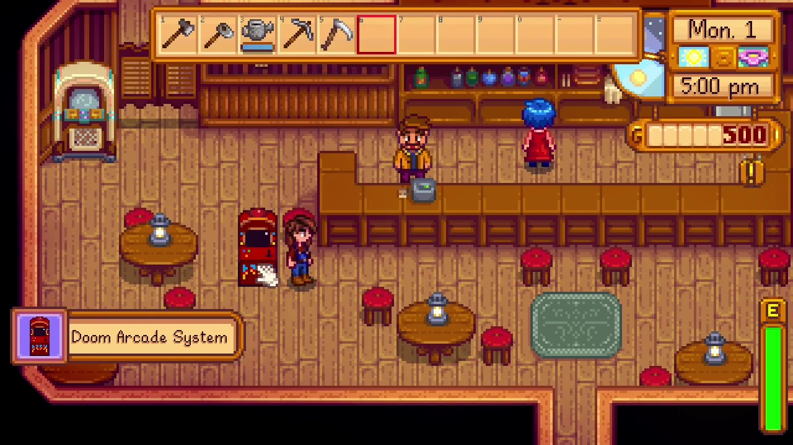

# DoomValley - Playable Doom in Stardew Valley

Source-port of [doomgeneric](https://github.com/ozkl/doomgeneric). Does not have sound. Playable on Windows and Linux.

Watch a video of it in action [here](https://youtu.be/cm0XKAgUfPw)!

## Installation

Grab the latest [release](https://github.com/wojciech-graj/DoomValley/releases), and extract it into your SMAPI Mods folder (`.../Mods/DoomValley/`).

You will need a WAD file (game data). If you don't own the game, the shareware version is freely available. (On linux, the WAD file should have a fully lowercase name). You should save the WAD in `.../Mods/DoomValley/filename.wad`.

### Linux

The `DoomValley/libdoomgeneric_stardew.so` shared library must be made available to the game. Either set `LD_LIBRARY_PATH` to include `.../Mods/DoomValley`, or copy `libdoomgeneric_stardew.so` to `/usr/local/lib/`.

## Controls
Default keybindings are listed below, and cannot currently be remapped without recompiling the mod.

|Action         |Default Keybind|
|---------------|---------------|
|UP             |ARROW UP		|
|DOWN			|ARROW DOWN		|
|LEFT			|ARROW LEFT		|
|RIGHT			|ARROW RIGHT	|
|FIRE			|SPACE			|
|USE			|E				|
|WEAPON SELECT  |1-7            |
